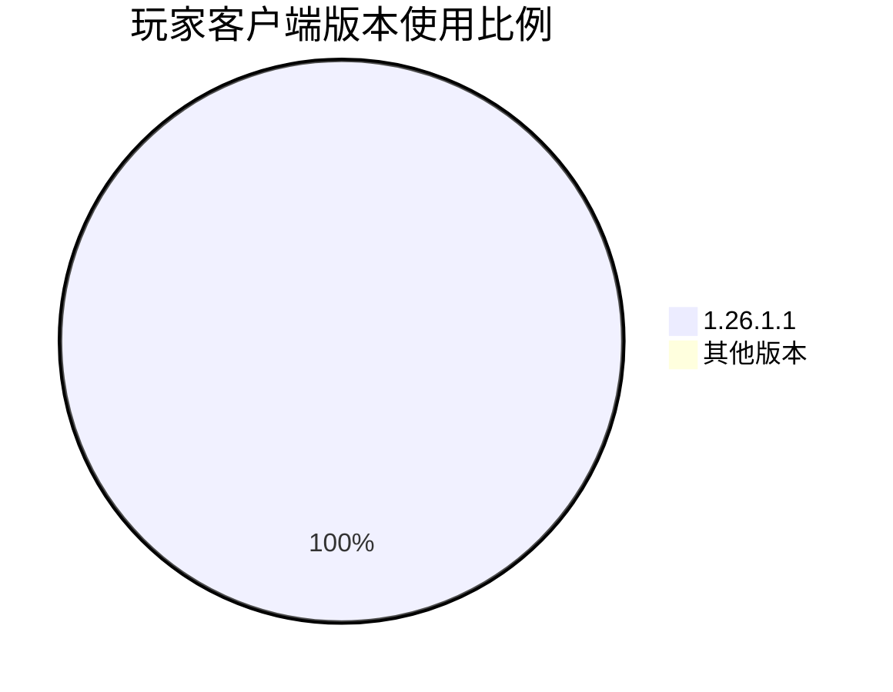
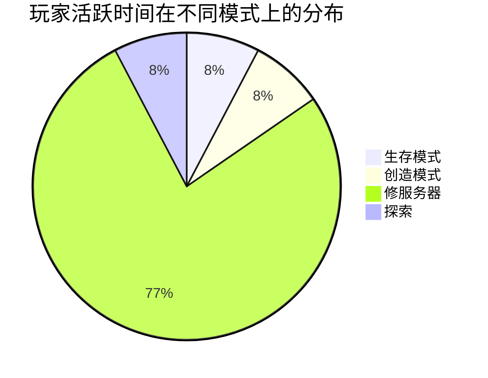
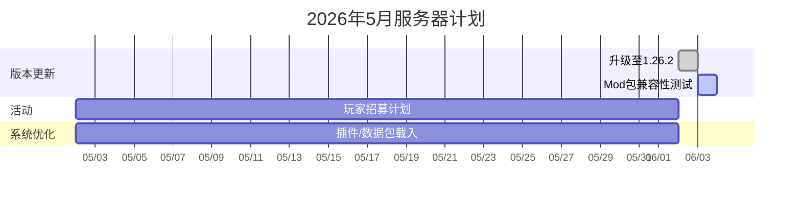

# 🎮 我的世界服务器月度运行报告

> 报告周期：**2026-04-01** 至 **2026-04-30**  
> 整理者：`小鱼仔娱乐`  
> 最后更新：`2026/05/02`

:::tip[如何阅读本报告]
- 带 `[请填写]` 的字段均为待填项，替换为实际数据即可。
- 部分图表使用 Mermaid 语法，在支持的环境中会自动渲染为图形。
- 报告中所有时间均为北京时间（UTC+8），除非特别说明。
:::

---

## 📋 目录

- [一、服务器总体概览](#一服务器总体概览)
- [二、玩家数据统计](#二玩家数据统计)
- [三、性能与硬件监控](#三性能与硬件监控)
- [四、插件与版本更新](#四插件与版本更新)
- [五、问题与故障处理](#五问题与故障处理)
- [六、财务与资源消耗](#六财务与资源消耗)
- [七、下月计划与展望](#七下月计划与展望)

---

## 一、服务器总体概览

| 项目                 | 本月数值                  | 较上月变化 |
|----------------------|---------------------------|------------|
| 平均在线玩家数       | `0.064`                | `↗️ +100%` |
| 单日最高在线         | `1` (4月`19`日)  | `↗️ +100%` |
| 新增注册玩家         | `1`                | `↗️ +100%` |
| 累计注册玩家总数     | `1`                |            |
| 当月总游戏时长       | `2.12` 小时           | `↗️ +100%` |
| 服务器正常运行时间   | `64.3%`                   | `↗️ +100%` |

:::note[正常波动说明]
本月因 `腐竹没登录控制台`，导致服务器未开启，属于预期范围外，下次会在每周六检查一次。
:::

---

## 二、玩家数据统计

### 2.1 每日在线峰值趋势

单日最高在线人数为`1`,较上个月增长`100%`。可喜可贺！

### 2.2 玩家版本分布

### 2.3 玩家游戏模式偏好

### 2.4 新玩家来源渠道

| 渠道               | 新增人数 | 占比   |
|--------------------|----------|--------|
| 论坛/贴吧推广      | `0`   | `0%` |
| 好友邀请           | `1`   | `100%` |
| 服务器列表站点     | `0`   | `0%` |
| 社交媒体/视频      | `0`   | `0%` |

:::tip[推广建议]
从数据看，`发现服务器没啥人玩` 但没事，下月我还开服。
:::

---

## 三、性能与硬件监控

### 3.1 服务器性能指标

本服务器采用阉割版i5-13600K处理器
拥有2H/8G/5M配置
无论从性能上还是性能上都远远超过i3-530!（bushi）

---

## 四、插件与版本更新

本月完成的插件/核心更新列表：

| 更新日期  | 内容     | 版本号            | 变更说明                         | 类型 | 
|-----------|-------------------|-------------------|----------------------------------|-   |
| 2026-05-02 | `[原版更新]vanilla-refresh`        | `1.4.30`  | 添加人工汉化   | 数据包 | 
| 2026-05-02 | `[地牢与酒馆]Dungeons and Taverns`        | `5.2.0`  | 添加人工汉化   | 数据包 | 
| 2026-05-02 | `[卡特斯结构]Katters Structures`          | `2.4.0`| 添加人工汉化                 | 数据包 | 
| 2026-05-02 | `[预生成区块]Chunky`          | `1.4.40`| 添加插件                 | 插件 | 
| 2026-05-02 | `[权限管理]LuckPerms`          | `5.5.17`| 添加插件                 | 插件 | 
| 2026-05-02 | `[迷你MOTD]minimotd`          | `2.2.3`| 添加插件                 | 插件 | 
| 2026-05-02 | `[语音聊天]PlasmoVoice`          | `2.1.9`| 添加插件                 | 插件 | 
| 2026-05-02 | `[坐]sit`          | `1.7.3`| 添加插件                 | 插件 | 
| 2026-05-02 | `[TAB]TAB`          | `6.0.2`| 添加人工汉化                 | 插件 | 
| 2026-05-01 | `[纸]paper`        | `26.1.1-29`           | 更新服务器核心       | 核心 | 
| 2026-05-01 | `[星际]Stellarity`        | `5.4.2`           | 添加模组       | 数据包 | 
| 2026-05-01 | `[星际虚空兼容性]Stellarity-NSC`        | `5.4.2`           | 添加兼容       | 数据包 | 

---

## 五、问题与故障处理

以下是本月出现的明显故障及处理详情：

> 5月1日 博学的UP （bushi
> **时间**：2026-05-01
> **现象**：腐竹登录服务器  
> **原因**：跑着跑着弹出一串英文
> **措施**：UP翻文件给大部分全汉化了一遍
> **效果**：提升本地化体验

---

## 六、财务与资源消耗

| 项目                 | 本月费用 (人民币) | 备注                         |
|----------------------|-------------------|------------------------------|
| 服务器主机租用       | `30`            | `i5-13600K，2H/8G/5M`       |
| 域名与 CDN           | `0`            |  截止6月前域名免费                            |
| 插件/Mod 授权费      | `0`            |                  |
| **合计**             | `30`            |                              |

流动资金来源：
- UP的钱包

---

## 七、下月计划与展望

**计划任务：**
- [ ] 发布服务器视频/图文（计划嵌入 GitHub 项目文档）  
::github{repo="chinachinese1/chinachinese1.github.io"}

- [ ] 引入反作弊系统，增加UP时间。

---

*本报告由 **Fishyflicks** 整理，欢迎玩家提出建议！*