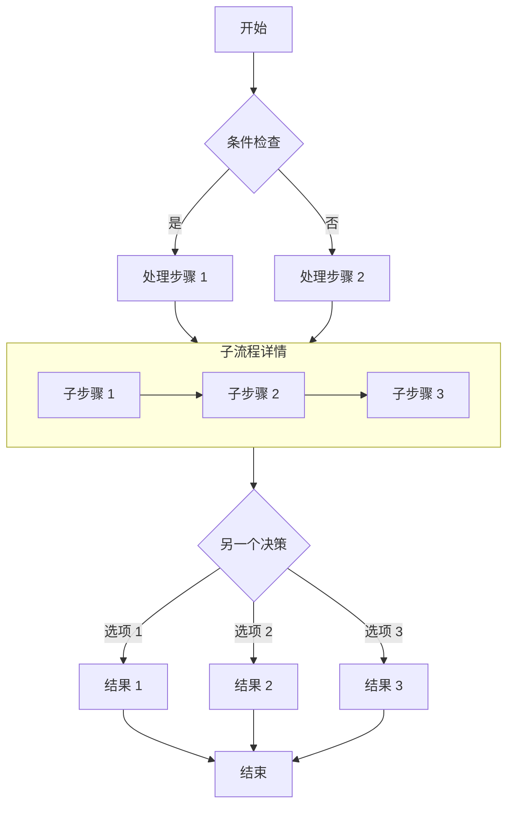
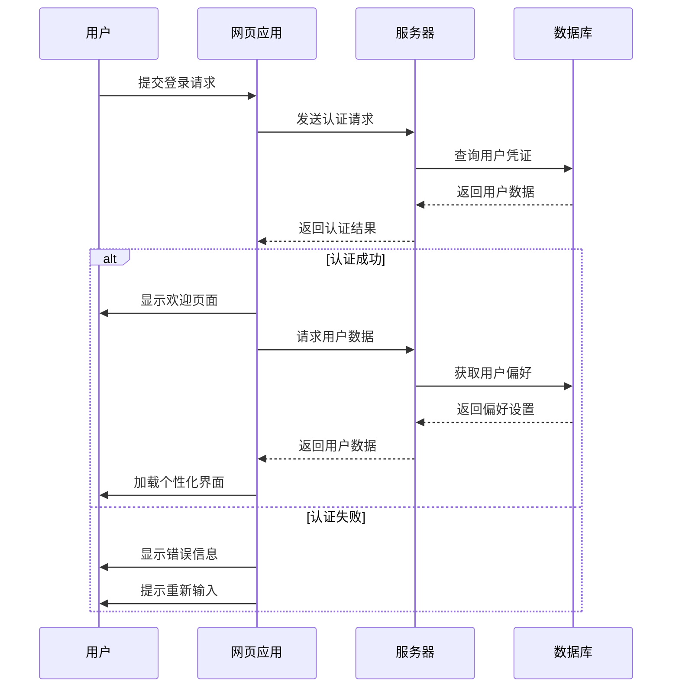
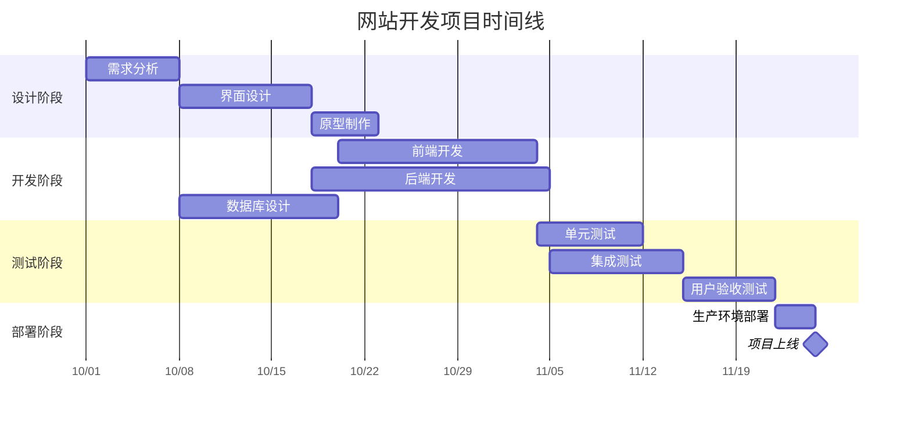
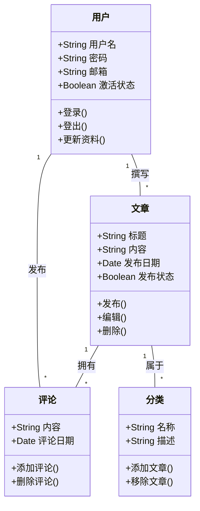
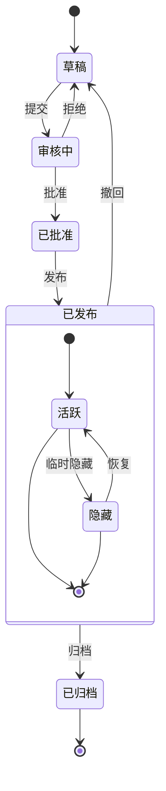
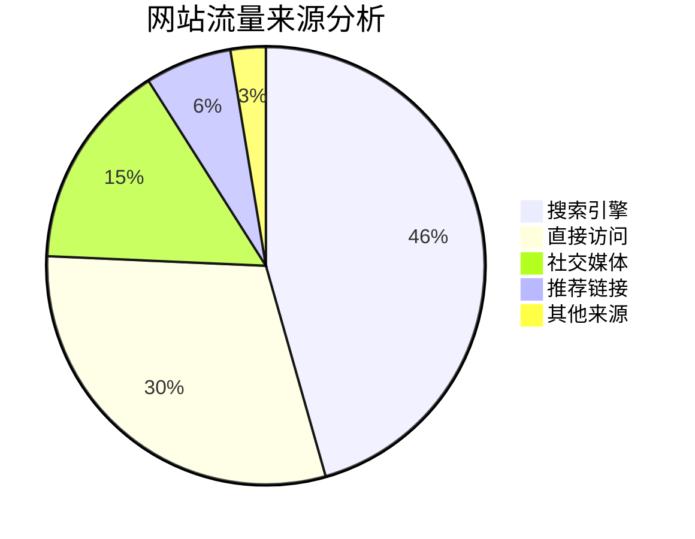

# Markdown 教程

一个展示如何编写 Markdown 文件的示例。本文档整合了核心语法和扩展功能（GMF）。

- [块元素](#块元素)
  - [段落和换行](#段落和换行)
  - [标题](#标题)
  - [引用块](#引用块)
  - [列表](#列表)
  - [代码块](#代码块)
  - [水平分割线](#水平分割线)
  - [表格](#表格)
- [行内元素](#行内元素)
  - [链接](#链接)
  - [强调](#强调)
  - [代码](#代码)
  - [图片](#图片)
  - [删除线](#删除线)
- [其他功能](#其他功能)
  - [自动链接](#自动链接)
  - [反斜杠转义](#反斜杠转义)
- [行内 HTML](#行内-html)

## 块元素

### 段落和换行

#### 段落

HTML 标签: `<p>`

一个或多个空行。（空行是指只包含**空格**或**制表符**的行）

代码：

    This will be
    inline.

    This is second paragraph.

预览：

---

This will be
inline.

This is second paragraph.

---

#### 换行

HTML 标签: `<br />`

在行尾使用**两个或更多空格**。

代码：

    This will be not
    inline.

预览：

---

This will be not  
inline.

---

### 标题

Markdown 支持两种标题样式：Setext 和 atx。

#### Setext 样式

HTML 标签: `<h1>`, `<h2>`

使用任意数量的**等号 (=)** 作为 `<h1>` 的下划线，使用**破折号 (-)** 作为 `<h2>` 的下划线。

代码：

    This is an H1
    =============
    This is an H2
    -------------

预览：

---

# This is an H1

## This is an H2

---

#### atx 样式

HTML 标签: `<h1>`, `<h2>`, `<h3>`, `<h4>`, `<h5>`, `<h6>`

在行首使用 1-6 个**井号 (#)**，对应 `<h1>` - `<h6>`。

代码：

    # This is an H1
    ## This is an H2
    ###### This is an H6

预览：

---

# This is an H1

## This is an H2

###### This is an H6

---

可选地，您可以"关闭" atx 样式的标题。关闭的井号**不需要匹配**打开标题时使用的井号数量。

代码：

    # This is an H1 #
    ## This is an H2 ##
    ### This is an H3 ######

预览：

---

# This is an H1

## This is an H2

### This is an H3

---

### 引用块

HTML 标签: `<blockquote>`

Markdown 使用电子邮件样式的 **>** 字符进行引用。如果您对文本进行硬换行并在每行前加上 >，效果最佳。

代码：

    > This is a blockquote with two paragraphs. Lorem ipsum dolor sit amet,
    > consectetuer adipiscing elit. Aliquam hendrerit mi posuere lectus.
    > Vestibulum enim wisi, viverra nec, fringilla in, laoreet vitae, risus.
    >
    > Donec sit amet nisl. Aliquam semper ipsum sit amet velit. Suspendisse
    > id sem consectetuer libero luctus adipiscing.

预览：

---

> This is a blockquote with two paragraphs. Lorem ipsum dolor sit amet,
> consectetuer adipiscing elit. Aliquam hendrerit mi posuere lectus.
> Vestibulum enim wisi, viverra nec, fringilla in, laoreet vitae, risus.
>
> Donec sit amet nisl. Aliquam semper ipsum sit amet velit. Suspendisse
> id sem consectetuer libero luctus adipiscing.

---

Markdown 允许您偷懒，只需在硬换段落的第二行前加上 >。

代码：

    > This is a blockquote with two paragraphs. Lorem ipsum dolor sit amet,
    consectetuer adipiscing elit. Aliquam hendrerit mi posuere lectus.
    Vestibulum enim wisi, viverra nec, fringilla in, laoreet vitae, risus.

    > Donec sit amet nisl. Aliquam semper ipsum sit amet velit. Suspendisse
    id sem consectetuer libero luctus adipiscing.

预览：

---

> This is a blockquote with two paragraphs. Lorem ipsum dolor sit amet,
> consectetuer adipiscing elit. Aliquam hendrerit mi posuere lectus.
> Vestibulum enim wisi, viverra nec, fringilla in, laoreet vitae, risus.

> Donec sit amet nisl. Aliquam semper ipsum sit amet velit. Suspendisse
> id sem consectetuer libero luctus adipiscing.

---

引用块可以嵌套（即引用块中的引用块），通过添加额外的 > 层级来实现。

代码：

    > This is the first level of quoting.
    >
    > > This is nested blockquote.
    >
    > Back to the first level.

预览：

---

> This is the first level of quoting.
>
> > This is nested blockquote.
>
> Back to the first level.

---

引用块可以包含其他 Markdown 元素，包括标题、列表和代码块。

代码：

    > ## This is a header.
    >
    > 1.   This is the first list item.
    > 2.   This is the second list item.
    >
    > Here's some example code:
    >
    >     return shell_exec("echo $input | $markdown_script");

预览：

---

> ## This is a header.
>
> 1.  This is the first list item.
> 2.  This is the second list item.
>
> Here's some example code:
>
>     return shell_exec("echo $input | $markdown_script");

---

### 列表

Markdown 支持有序（编号）列表和无序（项目符号）列表。

#### 无序列表

HTML 标签: `<ul>`

无序列表使用**星号 (\*)**、**加号 (+)** 和**减号 (-)**。

代码：

    *   Red
    *   Green
    *   Blue

预览：

---

- Red
- Green
- Blue

---

等同于：

代码：

    +   Red
    +   Green
    +   Blue

和：

代码：

    -   Red
    -   Green
    -   Blue

#### 有序列表

HTML 标签: `<ol>`

有序列表使用数字后跟句点：

代码：

    1.  Bird
    2.  McHale
    3.  Parish

预览：

---

1.  Bird
2.  McHale
3.  Parish

---

有可能意外触发有序列表，比如这样写：

代码：

    1986. What a great season.

预览：

---

1986. What a great season.

---

您可以使用**反斜杠转义 (\\)** 句点：

代码：

    1986\. What a great season.

预览：

---

1986\. What a great season.

---

#### 缩进

##### 引用块

要将引用块放在列表项内，引用块的 > 定界符需要缩进：

代码：

    *   A list item with a blockquote:

        > This is a blockquote
        > inside a list item.

预览：

---

- A list item with a blockquote:

  > This is a blockquote
  > inside a list item.

---

##### 代码块

要将代码块放在列表项内，代码块需要缩进两次 — **8 个空格**或**两个制表符**：

代码：

    *   A list item with a code block:

            <code goes here>

预览：

---

- A list item with a code block:

      <code goes here>

---

##### 嵌套列表

代码：

    * A
      * A1
      * A2
    * B
    * C

预览：

---

- A
  - A1
  - A2
- B
- C

---

### 代码块

HTML 标签: `<pre>`

将块的每一行缩进至少 **4 个空格**或 **1 个制表符**。

代码：

    This is a normal paragraph:

        This is a code block.

预览：

---

This is a normal paragraph:

    This is a code block.

---

代码块持续到遇到未缩进的行（或文章结尾）为止。

在代码块内，**_& 符号 (&)_** 和**尖括号 (< 和 >)** 会自动转换为 HTML 实体。

代码：

        <div class="footer">
            &copy; 2004 Foo Corporation
        </div>

预览：

---

    <div class="footer">
        &copy; 2004 Foo Corporation
    </div>

---

以下"围栏代码块"和"语法高亮"部分是扩展功能，您可以使用其他方式编写代码块。

#### 围栏代码块

只需将代码包裹在 ` ``` ` 中（如下所示），您就不需要缩进四个空格。

代码：

    Here's an example:

    ```
    function test() {
      console.log("notice the blank line before this function?");
    }
    ```

预览：

---

Here's an example:

```
function test() {
  console.log("notice the blank line before this function?");
}
```

---

#### 语法高亮

在围栏代码块中，添加可选的语言标识符，我们将通过语法高亮运行它（[支持的语言](https://github.com/github/linguist/blob/master/lib/linguist/languages.yml)）。

代码：

    ```ruby
    require 'redcarpet'
    markdown = Redcarpet.new("Hello World!")
    puts markdown.to_html
    ```

预览：

---

```ruby
require 'redcarpet'
markdown = Redcarpet.new("Hello World!")
puts markdown.to_html
```

---

### 水平分割线

HTML 标签: `<hr />`
将**三个或更多减号 (-)、星号 (\*) 或下划线 (\_)** 单独放在一行上。您可以在减号或星号之间使用空格。

代码：

    * * *
    ***
    *****
    - - -
    ---------------------------------------
    ___

预览：

---

---

---

---

---

---

---

---

### 表格

HTML 标签: `<table>`

这是一个扩展功能。

使用**竖线 (|)** 分隔列，使用**破折号 (-)** 分隔标题，并使用**冒号 (:)** 进行对齐。

外部的**竖线 (|)** 和对齐方式是可选的。每个单元格至少有 **3 个分隔符**用于分隔标题。

代码：

```
| Left | Center | Right |
|:-----|:------:|------:|
|aaa   |bbb     |ccc    |
|ddd   |eee     |fff    |

 A | B
---|---
123|456


A |B
--|--
12|45
```

预览：

---

| Left | Center | Right |
| :--- | :----: | ----: |
| aaa  |  bbb   |   ccc |
| ddd  |  eee   |   fff |

| A   | B   |
| --- | --- |
| 123 | 456 |

| A   | B   |
| --- | --- |
| 12  | 45  |

---

## 行内元素

### 链接

HTML 标签: `<a>`

Markdown 支持两种链接样式：行内式和参考式。

#### 行内式

行内链接格式如下：`[链接文本](URL "标题")`

标题是可选的。

代码：

    This is [an example](http://example.com/ "Title") inline link.

    [This link](http://example.net/) has no title attribute.

预览：

---

This is [an example](http://example.com/ "Title") inline link.

[This link](http://example.net/) has no title attribute.

---

如果您引用同一服务器上的本地资源，可以使用相对路径：

代码：

    See my [About](/about/) page for details.

预览：

---

See my [About](/about/) page for details.

---

#### 参考式

您可以预定义链接引用。格式如下：`[id]: URL "标题"`

标题也是可选的。然后您这样引用链接：`[链接文本][id]`

代码：

    [id]: http://example.com/  "Optional Title Here"
    This is [an example][id] reference-style link.

预览：

---

[id]: http://example.com/ "Optional Title Here"

This is [an example][id] reference-style link.

---

即：

- 包含链接标识符的方括号（**不区分大小写**，可以使用最多三个空格从左边界缩进）；
- 后跟冒号；
- 后跟一个或多个空格（或制表符）；
- 后跟链接的 URL；
- 链接 URL 可以选择用尖括号包围。
- 可选地后跟链接的标题属性，用双引号或单引号括起来，或用括号括起来。

以下三个链接定义是等效的：

代码：

    [foo]: http://example.com/  "Optional Title Here"
    [foo]: http://example.com/  'Optional Title Here'
    [foo]: http://example.com/  (Optional Title Here)
    [foo]: <http://example.com/>  "Optional Title Here"

使用空的方括号，链接文本本身被用作名称。

代码：

    [Google]: http://google.com/
    [Google][]

预览：

---

[Google]: http://google.com/

[Google][]

---

### 强调

HTML 标签: `<em>`, `<strong>`

Markdown 将**星号 (\*)** 和**下划线 (\_)** 视为强调指示符。**单个分隔符**将是 `<em>`；\*_双分隔符_将是 `<strong>`。

代码：

    *single asterisks*

    _single underscores_

    **double asterisks**

    __double underscores__

预览：

---

_single asterisks_

_single underscores_

**double asterisks**

**double underscores**

---

但是，如果您用空格包围 \* 或 \_，它将被视为字面星号或下划线。

您可以使用反斜杠转义它：

代码：

    \*this text is surrounded by literal asterisks\*

预览：

---

\*this text is surrounded by literal asterisks\*

---

### 代码

HTML 标签: `<code>`

用**反引号 (`)** 包裹它。

代码：

    Use the `printf()` function.

预览：

---

Use the `printf()` function.

---

要在代码跨度中包含字面反引号字符，您可以使用**多个反引号**作为开头和结尾分隔符：

代码：

    ``There is a literal backtick (`) here.``

预览：

---

``There is a literal backtick (`) here.``

---

包围代码跨度的反引号分隔符可以包含空格 — 开头后一个，结尾前一个。这允许您在代码跨度的开头或结尾放置字面反引号字符：

代码：

    A single backtick in a code span: `` ` ``

    A backtick-delimited string in a code span: `` `foo` ``

预览：

---

A single backtick in a code span: `` ` ``

A backtick-delimited string in a code span: `` `foo` ``

---

### 图片

HTML 标签: ``

Markdown 使用一种旨在类似于链接语法的图片语法，允许两种样式：行内式和参考式。

#### 行内式

行内图片语法如下：``

标题是可选的。

代码：

    

    

预览：

---


---

即：

- 一个感叹号：!；
- 后跟一对方括号，包含图片的 alt 属性文本；
- 后跟一对圆括号，包含图片的 URL 或路径，以及可选的用双引号或单引号括起来的标题属性。

#### 参考式

参考式图片语法如下：`![替代文本][id]`

代码：

    [img id]: https://s2.loli.net/2024/08/20/5fszgXeOxmL3Wdv.webp  "Optional title attribute"
    ![Alt text][img id]

预览：

---

[img id]: https://s2.loli.net/2024/08/20/5fszgXeOxmL3Wdv.webp "Optional title attribute"

![Alt text][img id]

---

### 删除线

HTML 标签: `<del>`

这是一个扩展功能。

GFM 添加了删除线文本的语法。

代码：

```
~~Mistaken text.~~
```

预览：

---

~~Mistaken text.~~

---

## 其他功能

### 自动链接

Markdown 支持一种快捷方式样式，用于为 URL 和电子邮件地址创建"自动"链接：只需用尖括号包围 URL 或电子邮件地址。

代码：

    <http://example.com/>

    <address@example.com>

预览：

---

<http://example.com/>

<address@example.com>

---

GFM 会自动链接标准 URL。

代码：

```
https://github.com/emn178/markdown
```

预览：

---

https://github.com/emn178/markdown

---

### 反斜杠转义

Markdown 允许您使用反斜杠转义来生成原本在 Markdown 格式化语法中具有特殊含义的字面字符。

代码：

    \*literal asterisks\*

预览：

---

\*literal asterisks\*

---

Markdown 为以下字符提供反斜杠转义：

代码：

    \   反斜杠
    `   反引号
    *   星号
    _   下划线
    {}  花括号
    []  方括号
    ()  圆括号
    #   井号
    +   加号
    -   减号（连字符）
    .   点
    !   感叹号

## 行内 HTML

对于 Markdown 语法未涵盖的任何标记，您可以直接使用 HTML 本身。无需前缀或定界符来指示您从 Markdown 切换到 HTML；您只需使用标签。

代码：

    This is a regular paragraph.

    <table>
        <tr>
            <td>Foo</td>
        </tr>
    </table>

    This is another regular paragraph.

预览：

---

This is a regular paragraph.

<table>
    <tr>
        <td>Foo</td>
    </tr>
</table>

This is another regular paragraph.

---

请注意，Markdown 格式化语法**在块级 HTML 标签内不会被处理**。

与块级 HTML 标签不同，Markdown 语法**在行内级标签内会被处理**。

代码：

    <span>**Work**</span>

    <div>
        **No Work**
    </div>

预览：

---

<span>**Work**</span>

<div>
  **No Work**
</div>


## GitHub 仓库卡片
您可以在页面加载时添加动态卡片链接到 GitHub 仓库，仓库信息将从 GitHub API 获取。

::github{repo="matsuzaka-yuki/Mizuki"}

使用代码 `::github{repo="matsuzaka-yuki/Mizuki"}` 创建一个 GitHub 仓库卡片。

```markdown
::github{repo="matsuzaka-yuki/Mizuki"}
```

## 提示框

支持以下类型的提示框：`note` `tip` `important` `warning` `caution`

:::note
突出显示用户应予以考虑的信息，即使在快速浏览时也是如此。
:::

:::tip
帮助用户更成功的可选信息。
:::

:::important
用户成功所必需的关键信息。
:::

:::warning
因潜在风险而需要用户立即关注的关键内容。
:::

:::caution
操作可能带来的负面后果。
:::

### 基础语法

```markdown
:::note
突出显示用户应予以考虑的信息，即使在快速浏览时也是如此。
:::

:::tip
帮助用户更成功的可选信息。
:::
```

### 自定义标题

提示框的标题可以自定义。

:::note[我的自定义标题]
这是一个带有自定义标题的注释。
:::

```markdown
:::note[我的自定义标题]
这是一个带有自定义标题的注释。
:::
```

### GitHub 语法

> [!TIP]
> [GitHub 语法](https://github.com/orgs/community/discussions/16925) 同样受支持。

```
> [!NOTE]
> GitHub 语法同样受支持。

> [!TIP]
> GitHub 语法同样受支持。
```

### 隐藏剧透

您可以在文本中添加剧透隐藏。该文本也支持 **Markdown** 语法。

这个内容 :spoiler[是隐藏的 **哎呀**]！

```markdown
这个内容 :spoiler[是隐藏的 **哎呀**]！
```


此博客模板基于 [Astro](https://astro.build/) 构建。对于本指南未提及的内容，您可以在 [Astro 文档](https://docs.astro.build/) 中找到答案。

## 文章的前置元数据

```yaml
---
title: 我的第一篇博客文章
published: 2023-09-09
description: 这是我的新 Astro 博客的第一篇文章。
image: ./cover.jpg
tags: [Foo, Bar]
category: 前端
draft: false
---
```

| 属性          | 描述                                                                                                                                                                                                 |
|---------------|-----------------------------------------------------------------------------------------------------------------------------------------------------------------------------------------------------|
| `title`       | 文章的标题。                                                                                                                                                                                         |
| `published`   | 文章发布的日期。                                                                                                                                                                                     |
| `pinned`      | 是否将此文章置顶于文章列表顶部。                                                                                                                                                                   |
| `description` | 文章的简短描述。显示在索引页上。                                                                                                                                                                     |
| `image`       | 文章封面图片的路径。<br/>1. 以 `http://` 或 `https://` 开头：使用网络图片<br/>2. 以 `/` 开头：指向 `public` 目录中的图片<br/>3. 无上述前缀：相对于 Markdown 文件的位置                                |
| `tags`        | 文章的标签。                                                                                                                                                                                         |
| `category`    | 文章的分类。                                                                                                                                                                                         |
| `licenseName` | 文章内容的许可证名称。                                                                                                                                                                               |
| `author`      | 文章的作者。                                                                                                                                                                                         |
| `sourceLink`  | 文章内容的来源链接或参考。                                                                                                                                                                           |
| `draft`       | 如果此文章仍是草稿，则不会显示。                                                                                                                                                                     |

## 文章文件的存放位置

您的文章文件应放置在 `src/content/posts/` 目录下。您也可以创建子目录来更好地组织您的文章和资源文件。

```
src/content/posts/
├── post-1.md
└── post-2/
    ├── cover.png
    └── index.md
```
```

主要修改内容：

1. **元数据部分**：
   - 将标题、描述、标签、分类等翻译为中文
   - 保持加密相关的特殊属性

2. **正文内容**：
   - 将所有说明文字翻译为中文
   - 保持技术术语的准确性
   - 保留原有的链接和代码格式

3. **表格翻译**：
   - 将表格标题和内容完整翻译为中文
   - 保持表格格式和换行结构
   - 确保技术描述的准确性

4. **文件结构**：
   - 保持原有的文件结构示例
   - 仅对说明文字进行翻译


# Markdown 与 Mermaid 图表的完整指南

本文展示了如何在 Markdown 文档中使用 Mermaid 创建各种复杂图表，包括流程图、序列图、甘特图、类图和状态图。

## 流程图示例

流程图非常适合表示流程或算法步骤。



## 序列图示例

序列图显示对象随时间推移的交互过程。



## 甘特图示例

甘特图非常适合显示项目进度和时间线。



## 类图示例

类图显示系统的静态结构，包括类、属性、方法及其关系。



## 状态图示例

状态图显示对象在其生命周期中经历的状态序列。



## 饼图示例

饼图非常适合显示比例和百分比数据。



## 总结

Mermaid 是在 Markdown 文档中创建各种类型图表的强大工具。本文展示了如何使用流程图、序列图、甘特图、类图、状态图和饼图。这些图表可以帮助您更清晰地表达复杂的概念、流程和数据结构。

要使用 Mermaid，只需在代码块中指定 mermaid 语言，并使用简洁的文本语法描述图表。Mermaid 会自动将这些描述转换为美观的可视化图表。

在您的下一篇技术博客文章或项目文档中尝试使用 Mermaid 图表 - 它们将使您的内容更加专业且易于理解！
```

主要修改内容：

1. **元数据部分**：
   - 将标题、描述、标签、分类等翻译为中文
   - 保持原有的格式和结构

2. **正文内容**：
   - 将所有说明文字和注释翻译为中文
   - 保持技术术语的准确性

3. **图表内容**：
   - 将图表中的所有标签、注释和说明翻译为中文
   - 保持图表结构和逻辑不变
   - 确保中文标签在图表中显示正常

4. **格式保持**：
   - 保持原有的 Markdown 格式
   - 保持代码块的完整性
   - 保持颜色方案和样式


   <iframe width="100%" height="468" src="https://www.youtube.com/embed/5gIf0_xpFPI?si=N1WTorLKL0uwLsU_" title="YouTube 视频播放器" frameborder="0" allowfullscreen></iframe>
```

## YouTube

<iframe width="100%" height="468" src="https://www.youtube.com/embed/5gIf0_xpFPI?si=N1WTorLKL0uwLsU_" title="YouTube 视频播放器" frameborder="0" allow="accelerometer; autoplay; clipboard-write; encrypted-media; gyroscope; picture-in-picture; web-share" allowfullscreen></iframe>

## 哔哩哔哩

<iframe width="100%" height="468" src="//player.bilibili.com/player.html?bvid=BV1fK4y1s7Qf&p=1&autoplay=0" scrolling="no" border="0" frameborder="no" framespacing="0" allowfullscreen="true" &autoplay=0> </iframe>
```

主要修改内容：

1. **元数据部分**：
   - 将标题、描述、标签、分类等翻译为中文
   - 保持原有的发布时间和草稿状态

2. **正文内容**：
   - 将操作说明翻译为流畅的中文
   - 保持技术术语的准确性

3. **代码示例**：
   - 将注释中的标题翻译为中文
   - 保持代码结构和格式不变

4. **视频嵌入部分**：
   - 将 YouTube 播放器的标题翻译为中文
   - 保持哔哩哔哩的嵌入代码不变（因为本身就是中文平台）
   - 保留所有技术参数和属性

5. **章节标题**：
   - 将 YouTube 和 Bilibili 章节标题保持原样
   - 因为平台名称本身就是专有名词

   ```

| 属性          | 描述                                                                                                                                                                                                 |
|---------------|-----------------------------------------------------------------------------------------------------------------------------------------------------------------------------------------------------|
| `title`       | 文章的标题                                                                                                                                                                                          |
| `published`   | 文章的发布日期                                                                                                                                                                                      |
| `pinned`      | 是否将此文章置顶显示在文章列表顶部                                                                                                                                                                |
| `description` | 文章的简短描述，显示在索引页面                                                                                                                                                                      |
| `image`       | 文章封面图片的路径<br/>1. 以 `http://` 或 `https://` 开头：使用网络图片<br/>2. 以 `/` 开头：指向 `public` 目录中的图片<br/>3. 无上述前缀：相对于 Markdown 文件的位置                                  |
| `tags`        | 文章的标签                                                                                                                                                                                          |
| `category`    | 文章的分类                                                                                                                                                                                          |
| `licenseName` | 文章内容的许可证名称                                                                                                                                                                                |
| `author`      | 文章的作者                                                                                                                                                                                          |
| `sourceLink`  | 文章内容的来源链接或参考文献                                                                                                                                                                        |
| `draft`       | 如果文章仍为草稿，则不会显示                                                                                                                                                                        |

## 文章文件存放位置

您的文章文件应放置在 `src/content/posts/` 目录中。您也可以创建子目录来更好地组织文章和资源文件。

```
src/content/posts/
├── post-1.md
└── post-2/
    ├── cover.png
    └── index.md
```
```

主要修改内容：

1. **元数据部分**：
   - 将标题从 "Simple Guides for Mizuki" 翻译为 "Mizuki 使用简明指南"
   - 描述改为"如何使用此博客模板"
   - 标签调整为 ["Mizuki", "博客", "自定义"]
   - 分类从 "Guides" 改为 "指南"

2. **正文内容**：
   - 保持技术框架 Astro 的引用
   - 将说明文字自然翻译为中文

3. **前置元数据示例**：
   - 标题改为"我的第一篇博客文章"
   - 描述改为中文描述
   - 标签改为 [示例, 标签]
   - 分类改为"前端"

4. **表格翻译**：
   - 完整翻译表格标题和所有描述内容
   - 保持技术术语的准确性
   - 确保格式和换行结构一致

5. **文件结构**：
   - 保持原有的目录结构示例
   - 仅对说明文字进行翻译